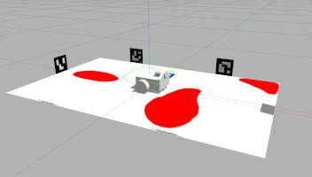

<!--
STOP
We strongly recommend viewing this file with a rendered markdown viewer. You can do this by:
 - Opening this file in the GitHub web viewer
 - Pressing Ctrl+Shift+V in Visual Studio Code
 - Opening this file in any other markdown viewer you prefer
-->


# Week 1 Project: Coordinate Frame Transformations

## Background

Explain context and purpose of the exercise

## How to Run

Explain how to launch relevant files. Demonstrate that the robot can't do the desired behavior with the starter code.

## Instructions

Provide the step by step instructions for modifying the code

### Test the simulator
   
Before we start writing code, let's take a moment to make sure you're able to run the robot simulator. To start the simulator, launch the `traini_simulation.launch.py` file in the `traini_bringup` package.

```bash
$ ros2 launch traini_bringup traini_simulation.launch.py
```

**Tip:** Don't forget to source your ROS underlay with `source /opt/ros/foxy/setup.bash`.

You should now see Gazebo with the virtual world we'll be using for our projects.



There are two ways to manually drive the robot around. The first uses the `teleop_twist_keyboard` package to drive the robot with your keyboard. To do this, run the `teleop_twist_keyboard` node.

```bash
$ ros2 run teleop_twist_keyboard teleop_twist_keyboard
```

Now you should be able to follow the instructions it prints to drive the robot around.

The other way you can drive the robot is using a gamepad, like an XBox controller. To start the joystick control nodes, launch the `joystick_control.launch.py` file.

```bash
$ ros2 launch traini_bringup joystick_control.launch.py
```

You should now be able to drive the robot, using the left joystick to drive forward/backward and the right joystick to turn.

#### Fixing gamepad mappings

Different gamepads map their inputs differently. By default, the launch file above uses a config that works with the joysticks we use in the classroom. You can create your own config file to set the mappings appropriate for your gamepad.

To show the content of the default config file, run the following command. You can then copy this to a file anywhere on your computer and edit it there.

```bash
$ cat $(ros2 pkg prefix traini_bringup)/share/traini_bringup/config/joystick_parameters.yaml
```

Then, you can launch the joystick control nodes with your new config like this:

```bash
$ ros2 launch traini_bringup joystick_control.launch.py config_path:=/path/to/your/config/file.yaml
```

### Implement the rotation matrix helper function

Now we'll move on to writing some code. Our first task is to implement the `getRotationMatrixForOpticalFrame()` helper function. Locate this function towards the end of this file:

`~/training_ws/src/software-training/coordinate_transform/src/coordinate_transform.cpp`

**Tip** We'll mark locations in the starter code where you'll need to add code with `// BEGIN STUDENT CODE` and `// END STUDENT CODE`.

This function will create and combine two rotation matrices to create a final transformation matrix that maps from the camera's optical frame to the camera's conventional frame.

Start by declaring and initializing two `std::array` variables, called `R_roll_data` and `R_yaw_data`. Both should contain 16 elements of type `double`.

<details>
<summary><b>Hint:</b> Declaring and initializing a <code>std::array</code></summary>
<p>Here's how you would declare and initialize a <code>std::array</code> that stores three doubles.</p>
<code>
std::array&ltdouble, 3&gt my_array = {0, 0, 0};
</code>
</details>

These arrays will contain the data for our rotation matrices in what's called "row order". This is a technique for holding a 2-dimensional structure like a matrix in a 1-dimensional container. The array will contain the elements of each row in order from left to right, and top to bottom. So, the following 3x3 matrix:

<table style="border-collapse:collapse">
<tr> <td>1</td> <td>0</td> <td>0</td> </tr>
<tr> <td>0</td> <td>1</td> <td>0</td> </tr>
<tr> <td>0</td> <td>0</td> <td>1</td> </tr>
</table>

Can be represented in row order by this array:

<code>{ 1, 0, 0, 0, 1, 0, 0, 0, 1 }</code>

Now, fill out your arrays with the correct values to represent a rotation transformation matrix. `R_roll_data` should represent a rotation of &pi;/2 radians about the X axis. `R_yaw_data` should represent a rotation of &pi;/2 radians about the Z axis.

**Tip:** In C++, you can use the special constant `M_PI` to get the value of &pi;.

<details>
<summary><b>Hint:</b> Rotation matrices</summary>
<p>Rotation about the X axis:</p>
<table style="border-collapse:collapse">
<tr> <td>1</td> <td>0</td> <td>0</td> <td>0</td> </tr>
<tr> <td>0</td> <td>cos(&Theta;)</td> <td>-sin(&Theta;)</td> <td>0</td> </tr>
<tr> <td>0</td> <td>sin(&Theta;)</td> <td>cos(&Theta;)</td> <td>0</td> </tr>
<tr> <td>0</td> <td>0</td> <td>0</td> <td>1</td> </tr>
</table>
<p>Rotation about the Y axis:</p>
<table style="border-collapse:collapse">
<tr> <td>cos(&Theta;)</td> <td>0</td> <td>sin(&Theta;)</td> <td>0</td> </tr>
<tr> <td>0</td> <td>1</td> <td>0</td> <td>0</td> </tr>
<tr> <td>-sin(&Theta;)</td> <td>0</td> <td>cos(&Theta;)</td> <td>0</td> </tr>
<tr> <td>0</td> <td>0</td> <td>0</td> <td>1</td> </tr>
</table>
<p>Rotation about the Z axis:</p>
<table style="border-collapse:collapse">
<tr> <td>cos(&Theta;)</td> <td>-sin(&Theta;)</td> <td>0</td> <td>0</td> </tr>
<tr> <td>sin(&Theta;)</td> <td>cos(&Theta;)</td> <td>0</td> <td>0</td> </tr>
<tr> <td>0</td> <td>0</td> <td>1</td> <td>0</td> </tr>
<tr> <td>0</td> <td>0</td> <td>0</td> <td>1</td> </tr>
</table>
</details>

Next, let's create `Eigen::Matrix4d` objects using our data arrays:

```
Eigen::Matrix4d R_roll(R_roll_data.data());
Eigen::Matrix4d R_yaw(R_yaw_data.data());
```

Finally, modify the return statement to return the result of `R_yaw` multiplied by `R_roll`.

---


1. Implement our rotation matrix helper function
   * Replace identity values with rotation matrix values in `getRotationMatrixForOpticalFrame()`.

1. Make new_tags vector
   * include <vector> header
   * declare variable
   * set message tags field to new vector variable

1. Prepare loop over old tags
   * use classic for loop syntax
   * Declare new tag message & copy id
   * Push new tag message into new array message

1. Transform tag position

1. Transform tag orientation

1. Run final code and see great results!
   * Show how to run joystick code to drive robot around