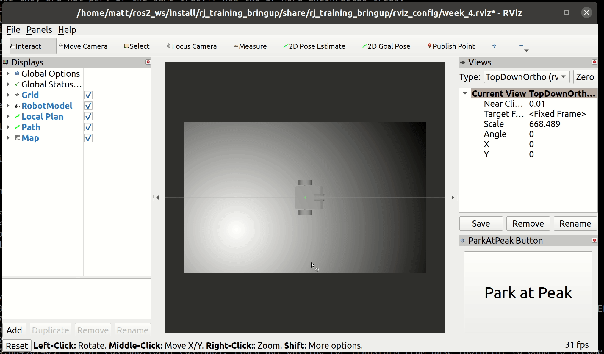

<!--
STOP
We strongly recommend viewing this file with a rendered markdown viewer. You can do this by:
 - Opening this file in the GitHub web viewer
 - Pressing Ctrl+Shift+V in Visual Studio Code
 - Opening this file in any other markdown viewer you prefer
-->

# Week 3 Project: Particle Filter Localization

<!-- START doctoc generated TOC please keep comment here to allow auto update -->
<!-- DON'T EDIT THIS SECTION, INSTEAD RE-RUN doctoc TO UPDATE -->
## Contents

- [1 Background](#1-background)
- [2 Running this project](#2-running-this-project)
- [3 Instructions](#3-instructions)
  - [3.1 Get the latest starter code](#31-get-the-latest-starter-code)
  - [3.2 Create service client](#32-create-service-client)
  - [3.3 Elevation Sampling: Send SampleElevation request](#33-elevation-sampling-send-sampleelevation-request)
  - [3.4 Elevation Sampling: Wait for SampleElevation response](#34-elevation-sampling-wait-for-sampleelevation-response)
  - [3.5 First Algorithm: Choose sample positions](#35-first-algorithm-choose-sample-positions)
  - [3.6 First Algorithm: Sample elevations](#36-first-algorithm-sample-elevations)
  - [3.7 First Algorithm: Choose goal position](#37-first-algorithm-choose-goal-position)
  - [3.8 Better algorithm?](#38-better-algorithm)
  - [3.9 Commit your new code in git](#39-commit-your-new-code-in-git)

<!-- END doctoc generated TOC please keep comment here to allow auto update -->

## 1 Background

This is an exciting week. Our robot will move autonomously for the first time!

This week, we'll be focussing on optimization by doing some literal (simulated) hill climbing. Part of the challenge our robot will need to complete at the end of the semester includes find the highest spot around it to park. While our real environment is flat, we have simulated terrain data which our robot can measure for the purposes of this task.

If our robot could see a terrain map of the entire world, this task would be really easy. We would just check every spot to find the max elevation and drive directly to it. Unfortunately, we don't have such a map in our scenario. The robot is limitted to checking the elevation at locations within a certain range of it's current position. Because our robot has this limitted view of the world around it, we need to use an iterative optimization algorithm to come up with individual steps that will take us to the peak.

### 2.1 The code

The code we'll be writing this week is in the [peak_finder](../../peak_finder) package. This package features a node that provides a ROS action the drives the robot to the highest point and stops. We'll talk in detail about actions later. For now, just know that this is a behavior we can trigger and cancel.

The bulk of the node has been setup for you. When the action is triggered, the node enters a loop where it picks a spot to move to using an optimization algorithm, moves to that location, and repeats. This loop ends when the optimization algorithm determines the robot is at the highest point.

There are two things you'll be implementing. The first is the service client used to get our simulated terrain measurements. This will be a client for the `/sample_elevation` service. You'll be setting up the client and implementing the `SampleElevation()` function which uses this client to get the elevation at a specific location.

The second part you'll be implementing is the optimization algorithm used to select the next pose for the robot to move to. This is wrapped up in the `PickNextGoalPosition()` function which takes the robot's current position and elevation and returns the next position the robot should move to. When the robot is at the peak, `PickNextGoalPosition()` will return `current_position`.

## 2 Running this project

This week's project is started with a single launch file.

```bash
ros2 launch rj_training_bringup week_4.launch.xml
```

We won't be launching any teleop nodes this week, since our robot will be moving autonomously. You can use the teleop moves to move your robot around, but you'll want to stop any teleop nodes before running the "park at peak" action.

When you launch the project, you'll be greeted by the usual two applications: gazebo and rviz. In rviz, you'll see a new button labelled "Park at Peak". Pressing this button will trigger the park at peak action you'll be implementing in this project. In the rviz 3D viewport, you'll see the simulated terrain map of the world with the highest elevations shown in white and the lowest in black.

The goal is that when you press the "Park at Peak" button, the robot should drive to and stop at the whitest spot on the map.



Before you write any code, the button will appear to do nothing. The starter code just immediately finishes, reporting that the robot is already at the peak. The code you write will give our robot the behavior we actually want.

## 3 Instructions

### 3.1 Get the latest starter code

To make sure you're starting with the latest starter code, pull from the git server in your copy of the software-training repository.

```bash
$ cd training_ws/src/software-training
$ git pull
```

You'll also want to make sure you've got the latest version of the training support library by running an apt package update.

```bash
$ sudo apt update
$ sudo apt upgrade
```

If you have done a different installation of stsl that is not through apt make sure to pull the latest code there.

### 3.2 Create service client

### 3.3 Elevation Sampling: Send SampleElevation request

### 3.4 Elevation Sampling: Wait for SampleElevation response

### 3.5 First Algorithm: Choose sample positions

### 3.6 First Algorithm: Sample elevations

### 3.7 First Algorithm: Choose goal position

### 3.8 Better algorithm?

### 3.9 Commit your new code in git

Once you've got your code for this project working, use the command below to commit it into git. This will make it easier to grab changes to the starter code for the remaining projects.

```bash
$ git commit -a -m "My project 4 code."
```
